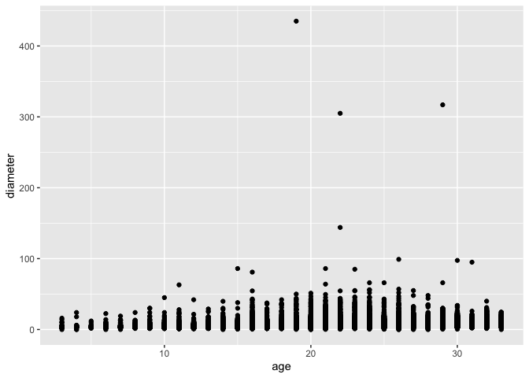
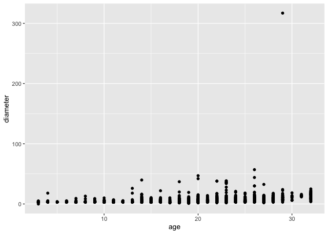
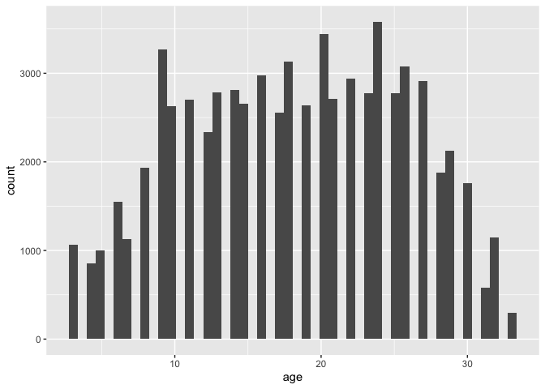
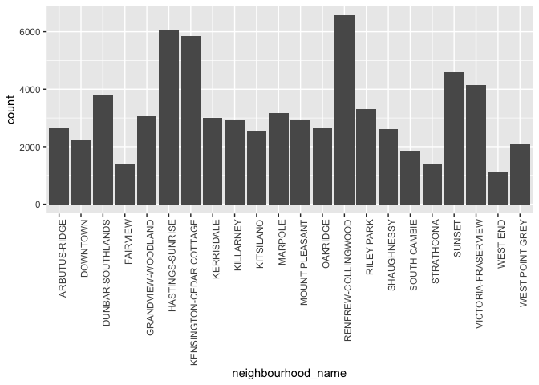
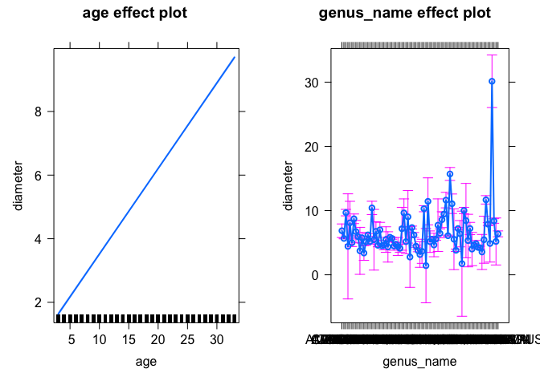
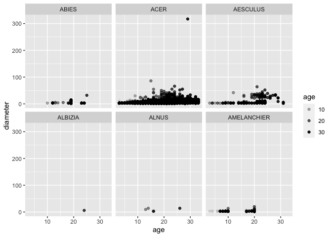
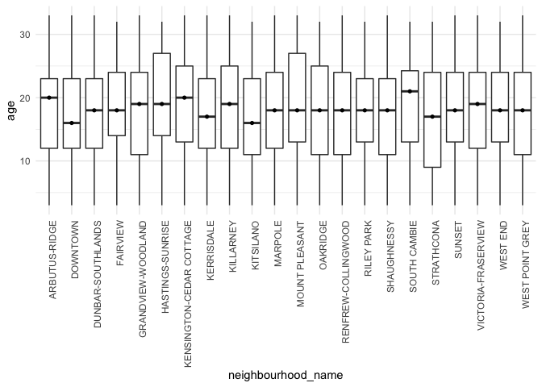
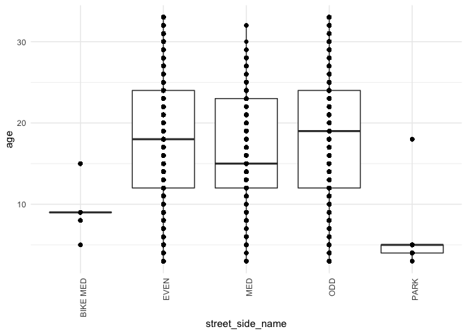
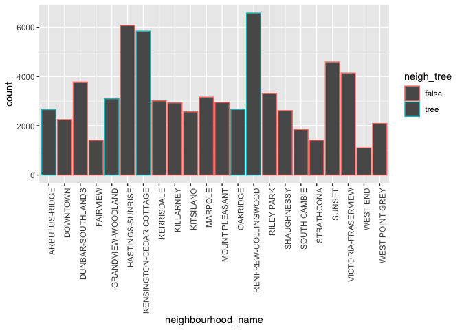

Mini Data-Analysis Deliverable 1
================

# Welcome to your (maybe) first-ever data analysis project!

And hopefully the first of many. Let’s get started:

1.  Install the [`datateachr`](https://github.com/UBC-MDS/datateachr)
    package by typing the following into your **R terminal**:

<!-- -->

    install.packages("devtools")
    devtools::install_github("UBC-MDS/datateachr")

\#mitchi: note to self, installing packages in the consule is best!!

2.  Load the packages below.

``` r
library(datateachr)
library(tidyverse)
```

    ## ── Attaching packages ─────────────────────────────────────── tidyverse 1.3.2 ──
    ## ✔ ggplot2 3.3.6      ✔ purrr   0.3.5 
    ## ✔ tibble  3.1.8      ✔ dplyr   1.0.10
    ## ✔ tidyr   1.2.0      ✔ stringr 1.4.0 
    ## ✔ readr   2.1.3      ✔ forcats 0.5.1 
    ## ── Conflicts ────────────────────────────────────────── tidyverse_conflicts() ──
    ## ✖ dplyr::filter() masks stats::filter()
    ## ✖ dplyr::lag()    masks stats::lag()

3.  Make a repository in the <https://github.com/stat545ubc-2022>
    Organization. You will be working with this repository for the
    entire data analysis project. You can either make it public, or make
    it private and add the TA’s and Lucy as collaborators. A link to
    help you create a private repository is available on the
    \#collaborative-project Slack channel.

# Instructions

## For Both Milestones

-   Each milestone is worth 45 points. The number of points allocated to
    each task will be annotated within each deliverable. Tasks that are
    more challenging will often be allocated more points.

-   10 points will be allocated to the reproducibility, cleanliness, and
    coherence of the overall analysis. While the two milestones will be
    submitted as independent deliverables, the analysis itself is a
    continuum - think of it as two chapters to a story. Each chapter, or
    in this case, portion of your analysis, should be easily followed
    through by someone unfamiliar with the content.
    [Here](https://swcarpentry.github.io/r-novice-inflammation/06-best-practices-R/)
    is a good resource for what constitutes “good code”. Learning good
    coding practices early in your career will save you hassle later on!

## For Milestone 1

**To complete this milestone**, edit [this very `.Rmd`
file](https://raw.githubusercontent.com/UBC-STAT/stat545.stat.ubc.ca/master/content/mini-project/mini-project-1.Rmd)
directly. Fill in the sections that are tagged with
`<!--- start your work below --->`.

**To submit this milestone**, make sure to knit this `.Rmd` file to an
`.md` file by changing the YAML output settings from
`output: html_document` to `output: github_document`. Commit and push
all of your work to the mini-analysis GitHub repository you made
earlier, and tag a release on GitHub. Then, submit a link to your tagged
release on canvas.

**Points**: This milestone is worth 45 points: 43 for your analysis, 1
point for having your Milestone 1 document knit error-free, and 1 point
for tagging your release on Github.

# Learning Objectives

By the end of this milestone, you should:

-   Become familiar with your dataset of choosing
-   Select 4 questions that you would like to answer with your data
-   Generate a reproducible and clear report using R Markdown
-   Become familiar with manipulating and summarizing your data in
    tibbles using `dplyr`, with a research question in mind.

# Task 1: Choose your favorite dataset (10 points)

The `datateachr` package by Hayley Boyce and Jordan Bourak currently
composed of 7 semi-tidy datasets for educational purposes. Here is a
brief description of each dataset:

-   *apt_buildings*: Acquired courtesy of The City of Toronto’s Open
    Data Portal. It currently has 3455 rows and 37 columns.

-   *building_permits*: Acquired courtesy of The City of Vancouver’s
    Open Data Portal. It currently has 20680 rows and 14 columns.

-   *cancer_sample*: Acquired courtesy of UCI Machine Learning
    Repository. It currently has 569 rows and 32 columns.

-   *flow_sample*: Acquired courtesy of The Government of Canada’s
    Historical Hydrometric Database. It currently has 218 rows and 7
    columns.

-   *parking_meters*: Acquired courtesy of The City of Vancouver’s Open
    Data Portal. It currently has 10032 rows and 22 columns.

-   *steam_games*: Acquired courtesy of Kaggle. It currently has 40833
    rows and 21 columns.

-   *vancouver_trees*: Acquired courtesy of The City of Vancouver’s Open
    Data Portal. It currently has 146611 rows and 20 columns.

**Things to keep in mind**

-   We hope that this project will serve as practice for carrying our
    your own *independent* data analysis. Remember to comment your code,
    be explicit about what you are doing, and write notes in this
    markdown document when you feel that context is required. As you
    advance in the project, prompts and hints to do this will be
    diminished - it’ll be up to you!

-   Before choosing a dataset, you should always keep in mind **your
    goal**, or in other ways, *what you wish to achieve with this data*.
    This mini data-analysis project focuses on *data wrangling*,
    *tidying*, and *visualization*. In short, it’s a way for you to get
    your feet wet with exploring data on your own.

And that is exactly the first thing that you will do!

1.1 Out of the 7 datasets available in the `datateachr` package, choose
**4** that appeal to you based on their description. Write your choices
below:

**Note**: We encourage you to use the ones in the `datateachr` package,
but if you have a dataset that you’d really like to use, you can include
it here. But, please check with a member of the teaching team to see
whether the dataset is of appropriate complexity. Also, include a
**brief** description of the dataset here to help the teaching team
understand your data.

<!-------------------------- Start your work below ---------------------------->

1: *cancer_sample* 2: *vancouver_trees* 3: *apt_buildings* 4:
*flow_sample*

I have my own dataset too, if this was something interesting to see for
the teaching team. I work with psycholinguistics data where participants
will listen to acoustic signal on a spectral-durational continuum from
the vowel in the word “BEAT” to the vowel in the word “BIT”.
Participants from different language backgrounds will categorize these
data as being “BEAT” or “BIT”. Bilinguals with experience in a creole
language called “Pidgin” are expected to be more experienced with Pidgin
and thus be better at using duration to differentiate between BEAT and
BIT, while English monolinguals are more likely to predominately use
spectral cues to differentiate between the vowels. The data is binomial
and quantified using each participants proportion of “BEAT” response,
using marked points along the spectral durational continuum.

As I am aiming to use the data included in cancer_sample or
vancouver_trees, I am trying to familiarize myself here. The
cancer_sample dataset appears to identify various (mean and sd) measures
of tumor samples per patient, the measures of their worst tumor, along
with each patient’s diagnosis as M = malignant, B = benign. The
vancouver_trees has data for each tree including its size, date planted
(which I will approximate to mean age), and the neighborhood it exists
in.

<!----------------------------------------------------------------------------->

1.2 One way to narrowing down your selection is to *explore* the
datasets. Use your knowledge of dplyr to find out at least *3*
attributes about each of these datasets (an attribute is something such
as number of rows, variables, class type…). The goal here is to have an
idea of *what the data looks like*.

*Hint:* This is one of those times when you should think about the
cleanliness of your analysis. I added a single code chunk for you below,
but do you want to use more than one? Would you like to write more
comments outside of the code chunk?

<!-------------------------- Start your work below ---------------------------->

``` r
### EXPLORE HERE ###
#steam_games  
#cancer_sample 
#apt_buildings
#vancouver_trees
#building_permits
#parking_meters
#flow_sample

#commenting these out after having explored them so I don't have these big datasets taking up space after knitting...
```

<!----------------------------------------------------------------------------->

1.3 Now that you’ve explored the 4 datasets that you were initially most
interested in, let’s narrow it down to 2. What lead you to choose these
2? Briefly explain your choices below, and feel free to include any code
in your explanation.

<!-------------------------- Start your work below ---------------------------->

I chose cancer_sample and vancouver_trees because I often work with
quantitative data and categorical data. Before my grad studies in
linguistics I studied biology (specifically in cancer genetics) and
worked in a lab (many years ago during my BA) so the data makes more
sense to me with cancer data and trees data. Perhaps neither is relevant
to my current work and I am not an expert on either dataset but I have a
good enough understanding of this for this project I think. I don’t know
much about the other topics and find the datasets a bit too untidy.
<!----------------------------------------------------------------------------->

1.4 Time for the final decision! Going back to the beginning, it’s
important to have an *end goal* in mind. For example, if I had chosen
the `titanic` dataset for my project, I might’ve wanted to explore the
relationship between survival and other variables. Try to think of 1
research question that you would want to answer with each dataset. Note
them down below, and make your final choice based on what seems more
interesting to you!

<!-------------------------- Start your work below ---------------------------->

RQ (cancer_sample): Which variable is the best predictor of a MALIGNANT
diagnosis? (Perhaps to start, comparing only ave radius, texture,
smoothness, and compactness) RQ (vancouver_trees): Does tree age
correlate to diameter for each species?

I have decided to work with “vancouver_trees”.
<!----------------------------------------------------------------------------->

# Important note

Read Tasks 2 and 3 *fully* before starting to complete either of them.
Probably also a good point to grab a coffee to get ready for the fun
part!

This project is semi-guided, but meant to be *independent*. For this
reason, you will complete tasks 2 and 3 below (under the **START HERE**
mark) as if you were writing your own exploratory data analysis report,
and this guidance never existed! Feel free to add a brief introduction
section to your project, format the document with markdown syntax as you
deem appropriate, and structure the analysis as you deem appropriate.
Remember, marks will be awarded for completion of the 4 tasks, but 10
points of the whole project are allocated to a reproducible and clean
analysis. If you feel lost, you can find a sample data analysis
[here](https://www.kaggle.com/headsortails/tidy-titarnic) to have a
better idea. However, bear in mind that it is **just an example** and
you will not be required to have that level of complexity in your
project.

# Task 2: Exploring your dataset (15 points)

If we rewind and go back to the learning objectives, you’ll see that by
the end of this deliverable, you should have formulated *4* research
questions about your data that you may want to answer during your
project. However, it may be handy to do some more exploration on your
dataset of choice before creating these questions - by looking at the
data, you may get more ideas. **Before you start this task, read all
instructions carefully until you reach START HERE under Task 3**.

2.1 Complete *4 out of the following 8 exercises* to dive deeper into
your data. All datasets are different and therefore, not all of these
tasks may make sense for your data - which is why you should only answer
*4*. Use *dplyr* and *ggplot*.

-\> 1. Plot the distribution of a numeric variable. -\> 2. Create a new
variable based on other variables in your data (only if it makes sense)
3. Investigate how many missing values there are per variable. Can you
find a way to plot this? -\> 4. Explore the relationship between 2
variables in a plot. -\> 5. Filter observations in your data according
to your own criteria. Think of what you’d like to explore - again, if
this was the `titanic` dataset, I may want to narrow my search down to
passengers born in a particular year… 6. Use a boxplot to look at the
frequency of different observations within a single variable. You can do
this for more than one variable if you wish! 7. Make a new tibble with a
subset of your data, with variables and observations that you are
interested in exploring. 8. Use a density plot to explore any of your
variables (that are suitable for this type of plot).

2.2 For each of the 4 exercises that you complete, provide a *brief
explanation* of why you chose that exercise in relation to your data (in
other words, why does it make sense to do that?), and sufficient
comments for a reader to understand your reasoning and code.

<!-------------------------- Start your work below ---------------------------->

Taking a look at my data…

``` r
vancouver_trees
```

    ## # A tibble: 146,611 × 20
    ##    tree_id civic_number std_st…¹ genus…² speci…³ culti…⁴ commo…⁵ assig…⁶ root_…⁷
    ##      <dbl>        <dbl> <chr>    <chr>   <chr>   <chr>   <chr>   <chr>   <chr>  
    ##  1  149556          494 W 58TH … ULMUS   AMERIC… BRANDON BRANDO… N       N      
    ##  2  149563          450 W 58TH … ZELKOVA SERRATA <NA>    JAPANE… N       N      
    ##  3  149579         4994 WINDSOR… STYRAX  JAPONI… <NA>    JAPANE… N       N      
    ##  4  149590          858 E 39TH … FRAXIN… AMERIC… AUTUMN… AUTUMN… Y       N      
    ##  5  149604         5032 WINDSOR… ACER    CAMPES… <NA>    HEDGE … N       N      
    ##  6  149616          585 W 61ST … PYRUS   CALLER… CHANTI… CHANTI… N       N      
    ##  7  149617         4909 SHERBRO… ACER    PLATAN… COLUMN… COLUMN… N       N      
    ##  8  149618         4925 SHERBRO… ACER    PLATAN… COLUMN… COLUMN… N       N      
    ##  9  149619         4969 SHERBRO… ACER    PLATAN… COLUMN… COLUMN… N       N      
    ## 10  149625          720 E 39TH … FRAXIN… AMERIC… AUTUMN… AUTUMN… N       N      
    ## # … with 146,601 more rows, 11 more variables: plant_area <chr>,
    ## #   on_street_block <dbl>, on_street <chr>, neighbourhood_name <chr>,
    ## #   street_side_name <chr>, height_range_id <dbl>, diameter <dbl>, curb <chr>,
    ## #   date_planted <date>, longitude <dbl>, latitude <dbl>, and abbreviated
    ## #   variable names ¹​std_street, ²​genus_name, ³​species_name, ⁴​cultivar_name,
    ## #   ⁵​common_name, ⁶​assigned, ⁷​root_barrier

Exercise 1 (From \#2. Create a new variable based on other variables in
your data (only if it makes sense))

What I did: The date_planted variable was a bit tricky to work with as a
continuous variable so I created two new variables from this variable
called “year” and “age”. “Year” simply extracts the year from the
date_planted, and “age” determines what the current age of the tree is
in the present year 2022.

``` r
library(lubridate)
```

    ## 
    ## Attaching package: 'lubridate'

    ## The following objects are masked from 'package:base':
    ## 
    ##     date, intersect, setdiff, union

``` r
vt<- vancouver_trees %>% select(tree_id, genus_name, species_name, common_name, neighbourhood_name, street_side_name, diameter, date_planted, height_range_id) %>% 
  mutate(year = year(date_planted)) %>% filter(!year == "<NA>") %>% mutate(age = 2022- year)
vt
```

    ## # A tibble: 70,063 × 11
    ##    tree_id genus_name speci…¹ commo…² neigh…³ stree…⁴ diame…⁵ date_pla…⁶ heigh…⁷
    ##      <dbl> <chr>      <chr>   <chr>   <chr>   <chr>     <dbl> <date>       <dbl>
    ##  1  149556 ULMUS      AMERIC… BRANDO… MARPOLE EVEN      10    1999-01-13       2
    ##  2  149563 ZELKOVA    SERRATA JAPANE… MARPOLE EVEN      10    1996-05-31       4
    ##  3  149579 STYRAX     JAPONI… JAPANE… KENSIN… EVEN       4    1993-11-22       3
    ##  4  149590 FRAXINUS   AMERIC… AUTUMN… KENSIN… EVEN      18    1996-04-29       4
    ##  5  149604 ACER       CAMPES… HEDGE … KENSIN… EVEN       9    1993-12-17       2
    ##  6  149617 ACER       PLATAN… COLUMN… KENSIN… ODD       15    1993-12-16       3
    ##  7  149618 ACER       PLATAN… COLUMN… KENSIN… ODD       14    1993-12-16       3
    ##  8  149619 ACER       PLATAN… COLUMN… KENSIN… ODD       16    1993-12-16       2
    ##  9  149625 FRAXINUS   AMERIC… AUTUMN… KENSIN… EVEN       7.5  1993-12-03       2
    ## 10  149626 TILIA      EUCHLO… CRIMEA… KENSIN… EVEN       7.75 1993-12-03       2
    ## # … with 70,053 more rows, 2 more variables: year <dbl>, age <dbl>, and
    ## #   abbreviated variable names ¹​species_name, ²​common_name,
    ## #   ³​neighbourhood_name, ⁴​street_side_name, ⁵​diameter, ⁶​date_planted,
    ## #   ⁷​height_range_id

Exercise 2 (#4 Explore the relationship between 2 variables in a plot.)
What I did: I investigated the relation between the tree’s age and the
tree’s diameter by plotting the data on a new variable called “age” as
the independent variable and “diameter” as the dependent variable.

``` r
ggplot(vt, aes(x= age, y = diameter)) + geom_point() + labs(x="age", y="diameter")
```

<!-- -->

Exercise 3 (Point \#5: Filter observations in your data according to
your own criteria. Think of what you’d like to explore - again, if this
was the `titanic` dataset, I may want to narrow my search down to
passengers born in a particular year.)

What I did: I am interested to see if trees sampled from Kitsilano had a
different distribution than the greater Vancouver context does. To
investigate this, I filtered in only data that was associated with trees
which came from the neighborhood of Kitsilano.

``` r
vt_kits <- vt%>% filter(neighbourhood_name == "KITSILANO")
vt_kits
```

    ## # A tibble: 2,564 × 11
    ##    tree_id genus_name speci…¹ commo…² neigh…³ stree…⁴ diame…⁵ date_pla…⁶ heigh…⁷
    ##      <dbl> <chr>      <chr>   <chr>   <chr>   <chr>     <dbl> <date>       <dbl>
    ##  1  155373 PRUNUS     CERASI… NIGHT … KITSIL… EVEN       10   2000-01-21       1
    ##  2  155413 ULMUS      AMERIC… BRANDO… KITSIL… EVEN       14.5 2000-01-21       4
    ##  3  155445 ACER       FREEMA… FREEMA… KITSIL… ODD         3   1997-03-20       2
    ##  4  155446 ACER       RUBRUM  KARPIC… KITSIL… EVEN       16   1996-04-16       4
    ##  5  156380 FRAXINUS   PENNSY… PATMOR… KITSIL… ODD        14   1994-11-22       3
    ##  6  156382 FRAXINUS   PENNSY… PATMOR… KITSIL… ODD        17.8 1994-11-22       2
    ##  7  156390 ACER       CAMPES… HEDGE … KITSIL… ODD        10   1994-11-21       2
    ##  8  156413 FRAXINUS   AMERIC… AUTUMN… KITSIL… ODD        10   1994-11-23       2
    ##  9  156487 ACER       PLATAN… GLOBEH… KITSIL… EVEN        5   1994-11-15       2
    ## 10  156489 ACER       CAMPES… HEDGE … KITSIL… EVEN       10   1994-11-15       2
    ## # … with 2,554 more rows, 2 more variables: year <dbl>, age <dbl>, and
    ## #   abbreviated variable names ¹​species_name, ²​common_name,
    ## #   ³​neighbourhood_name, ⁴​street_side_name, ⁵​diameter, ⁶​date_planted,
    ## #   ⁷​height_range_id

``` r
ggplot(vt_kits, aes(x= age, y = diameter)) + geom_point() + labs(x="age", y="diameter")
```

<!-- -->
Exercise 4 (Point \# 1 Plot the distribution of a numeric variable.)
What I did: I wanted to understand the age distribution for the trees?
To visualize this I plotted the distribution by age.

``` r
ggplot(vt, aes(age)) +
  geom_histogram(bins = 50)
```

<!-- --> An
extra exercise for curiosity (Point \# 1 Plot the distribution of a
numeric variable.) …

What I was interested in: Which neighborhood has the most trees? I made
a histogram here with the count of trees in each neighborhood.

``` r
ggplot(vt, aes(neighbourhood_name)) +
  geom_bar(stat="count") + theme(axis.text.x = element_text(angle = 90, hjust = 1))
```

<!-- -->

<!----------------------------------------------------------------------------->

# Task 3: Write your research questions (5 points)

So far, you have chosen a dataset and gotten familiar with it through
exploring the data. Now it’s time to figure out 4 research questions
that you would like to answer with your data! Write the 4 questions and
any additional comments at the end of this deliverable. These questions
are not necessarily set in stone - TAs will review them and give you
feedback; therefore, you may choose to pursue them as they are for the
rest of the project, or make modifications!

<!--- *****START HERE***** --->

RQ1: Is there a relationship between trees’ age and size (diameter) when
faceting by tree genus?

RQ2: Are the neighborhoods with the most trees the same neighbors that
have the oldest and biggest trees (height index + diameter)?

RQ3: Does the side of the street (ODD or EVEN) have differences in
regard to the types of trees which occur on each side of the road?

RQ4: Do neighborhoods that have a name that is “tree-associated”
(e.g. arbutus, woodland, cedar cottage, oakridge) have more trees on
average than neighborhoods with “non-tree-associated” names?

<!----------------------------------------------------------------------------->

# Task 4: Process and summarize your data (13 points)

From Task 2, you should have an idea of the basic structure of your
dataset (e.g. number of rows and columns, class types, etc.). Here, we
will start investigating your data more in-depth using various data
manipulation functions.

### 1.1 (10 points)

Now, for each of your four research questions, choose one task from
options 1-4 (summarizing), and one other task from 4-8 (graphing). You
should have 2 tasks done for each research question (8 total). Make sure
it makes sense to do them! (e.g. don’t use a numerical variables for a
task that needs a categorical variable.). Comment on why each task helps
(or doesn’t!) answer the corresponding research question.

Ensure that the output of each operation is printed!

**Summarizing:**

1.  Compute the *range*, *mean*, and *two other summary statistics* of
    **one numerical variable** across the groups of **one categorical
    variable** from your data.
2.  Compute the number of observations for at least one of your
    categorical variables. Do not use the function `table()`!
3.  Create a categorical variable with 3 or more groups from an existing
    numerical variable. You can use this new variable in the other
    tasks! *An example: age in years into “child, teen, adult, senior”.*
4.  Based on two categorical variables, calculate two summary statistics
    of your choosing.

**Graphing:**

5.  Create a graph out of summarized variables that has at least two
    geom layers.
6.  Create a graph of your choosing, make one of the axes logarithmic,
    and format the axes labels so that they are “pretty” or easier to
    read.
7.  Make a graph where it makes sense to customize the alpha
    transparency.
8.  Create 3 histograms out of summarized variables, with each histogram
    having different sized bins. Pick the “best” one and explain why it
    is the best.

Make sure it’s clear what research question you are doing each operation
for!

<!------------------------- Start your work below ----------------------------->

RQ1: Is there a relationship between trees’ age and size (diameter) when
faceting by tree species?

**Summarizing** -\> Based on two categorical variables, calculate two
summary statistics of your choosing.

Here, I am interested in whether there is a relationship between age and
size (diameter) of trees when considering tree genus. Based on this
model, it appears that there is a significant relationship between the
two when considering tree genus.

``` r
library(effects)
```

    ## Loading required package: carData

    ## lattice theme set by effectsTheme()
    ## See ?effectsTheme for details.

``` r
mod_1 <- lm(diameter ~ age + genus_name, data=vt)
summary(mod_1)
```

    ## 
    ## Call:
    ## lm(formula = diameter ~ age + genus_name, data = vt)
    ## 
    ## Residuals:
    ##    Min     1Q Median     3Q    Max 
    ## -16.81  -1.82  -0.39   1.14 430.50 
    ## 
    ## Coefficients:
    ##                          Estimate Std. Error t value Pr(>|t|)    
    ## (Intercept)               1.98443    0.54066   3.670 0.000242 ***
    ## age                       0.26894    0.00225 119.550  < 2e-16 ***
    ## genus_nameACER           -1.20265    0.53990  -2.228 0.025914 *  
    ## genus_nameAESCULUS        2.82187    0.59699   4.727 2.28e-06 ***
    ## genus_nameALBIZIA        -2.43911    4.21030  -0.579 0.562376    
    ## genus_nameALNUS           1.23833    1.78790   0.693 0.488553    
    ## genus_nameAMELANCHIER    -1.86963    0.61664  -3.032 0.002430 ** 
    ## genus_nameBETULA          1.85909    0.66023   2.816 0.004867 ** 
    ## genus_nameCALOCEDRUS     -0.13845    1.04074  -0.133 0.894166    
    ## genus_nameCARPINUS       -0.91396    0.54330  -1.682 0.092527 .  
    ## genus_nameCASTANEA       -3.13153    1.94369  -1.611 0.107156    
    ## genus_nameCATALPA        -1.09204    0.68583  -1.592 0.111320    
    ## genus_nameCEDRUS         -3.46881    0.79115  -4.385 1.16e-05 ***
    ## genus_nameCELTIS         -1.72766    0.60716  -2.845 0.004436 ** 
    ## genus_nameCERCIDIPHYLLUM -0.64700    0.54850  -1.180 0.238169    
    ## genus_nameCERCIS         -1.68985    0.57649  -2.931 0.003377 ** 
    ## genus_nameCHAMAECYPARIS   3.55630    0.75323   4.721 2.35e-06 ***
    ## genus_nameCHITALPA       -1.40493    2.47043  -0.569 0.569561    
    ## genus_nameCLADRASTIS     -0.09935    0.93387  -0.106 0.915276    
    ## genus_nameCORNUS         -2.27365    0.55114  -4.125 3.71e-05 ***
    ## genus_nameCORYLUS         0.13457    0.80417   0.167 0.867106    
    ## genus_nameCRATAEGUS      -2.35310    0.54496  -4.318 1.58e-05 ***
    ## genus_nameDAVIDIA        -2.24794    0.65331  -3.441 0.000580 ***
    ## genus_nameEUCOMMIA       -1.37181    1.14730  -1.196 0.231825    
    ## genus_nameEUONYMUS       -2.52145    1.32046  -1.910 0.056198 .  
    ## genus_nameFAGUS          -1.01880    0.54382  -1.873 0.061012 .  
    ## genus_nameFRAXINUS       -1.19733    0.54264  -2.206 0.027352 *  
    ## genus_nameGINKGO         -2.37608    0.63436  -3.746 0.000180 ***
    ## genus_nameGLEDITSIA      -2.10875    0.55447  -3.803 0.000143 ***
    ## genus_nameGYMNOCLADUS    -2.45632    0.89641  -2.740 0.006142 ** 
    ## genus_nameHIBISCUS       -2.72797    0.62384  -4.373 1.23e-05 ***
    ## genus_nameILEX            0.30562    1.78790   0.171 0.864275    
    ## genus_nameJUGLANS         2.77170    1.23937   2.236 0.025330 *  
    ## genus_nameKOELREUTERIA   -1.70131    1.09957  -1.547 0.121809    
    ## genus_nameLABURNUM        2.16509    2.15629   1.004 0.315343    
    ## genus_nameLARIX          -4.09438    2.47034  -1.657 0.097439 .  
    ## genus_nameLIQUIDAMBAR     0.49221    0.55189   0.892 0.372473    
    ## genus_nameLIRIODENDRON   -0.66093    0.57367  -1.152 0.249282    
    ## genus_nameMAGNOLIA       -2.40698    0.54624  -4.406 1.05e-05 ***
    ## genus_nameMALUS          -3.10852    0.54568  -5.697 1.23e-08 ***
    ## genus_nameMANGLIETIA     -3.71114    1.14728  -3.235 0.001218 ** 
    ## genus_nameMESPILUS       -3.20184    1.09922  -2.913 0.003583 ** 
    ## genus_nameMETASEQUOIA     3.42939    0.59039   5.809 6.32e-09 ***
    ## genus_nameMICHELIA       -5.43911    3.00145  -1.812 0.069966 .  
    ## genus_nameMORUS           4.57308    1.94369   2.353 0.018637 *  
    ## genus_nameNOTHOFAGUS     -1.70280    1.00855  -1.688 0.091344 .  
    ## genus_nameNYSSA          -1.31178    0.57724  -2.272 0.023060 *  
    ## genus_nameOSTRYIA        -2.21924    1.07829  -2.058 0.039583 *  
    ## genus_namePARROTIA       -1.28916    0.54877  -2.349 0.018819 *  
    ## genus_namePAULOWNIA       0.86772    2.15630   0.402 0.687380    
    ## genus_namePICEA          -0.41418    0.64572  -0.641 0.521249    
    ## genus_namePINUS           1.72340    0.82886   2.079 0.037600 *  
    ## genus_namePLATANUS        2.58488    0.56415   4.582 4.62e-06 ***
    ## genus_namePOPULUS         4.76885    0.81832   5.828 5.65e-09 ***
    ## genus_namePRUNUS         -0.77539    0.54091  -1.433 0.151722    
    ## genus_namePSEUDOTSUGA     8.83680    0.74484  11.864  < 2e-16 ***
    ## genus_namePTEROCARYA      4.20067    0.94439   4.448 8.68e-06 ***
    ## genus_namePTEROSTYRAX    -1.32420    2.47035  -0.536 0.591934    
    ## genus_namePYRUS          -3.04886    0.54719  -5.572 2.53e-08 ***
    ## genus_nameQUERCUS         0.33645    0.54576   0.616 0.537578    
    ## genus_nameRHAMNUS        -0.46586    1.17492  -0.396 0.691738    
    ## genus_nameRHUS           -5.13227    4.21029  -1.219 0.222854    
    ## genus_nameROBINIA         3.15193    0.59469   5.300 1.16e-07 ***
    ## genus_nameSALIX           1.57984    3.00144   0.526 0.598641    
    ## genus_nameSEQUOIA        -1.53188    2.15629  -0.710 0.477442    
    ## genus_nameSEQUOIADENDRON  0.34799    0.72541   0.480 0.631436    
    ## genus_nameSOPHORA        -2.85649    1.42625  -2.003 0.045203 *  
    ## genus_nameSORBUS         -2.21038    0.55256  -4.000 6.33e-05 ***
    ## genus_nameSTEWARTIA      -2.01319    0.59756  -3.369 0.000755 ***
    ## genus_nameSTYRAX         -2.59293    0.55121  -4.704 2.55e-06 ***
    ## genus_nameSYRINGA        -2.64086    0.55183  -4.786 1.71e-06 ***
    ## genus_nameTAXODIUM       -3.30777    1.49263  -2.216 0.026689 *  
    ## genus_nameTAXUS          -1.40196    1.94365  -0.721 0.470725    
    ## genus_nameTHUJA           4.81028    0.63433   7.583 3.41e-14 ***
    ## genus_nameTILIA           1.02865    0.55263   1.861 0.062695 .  
    ## genus_nameTRACHYCARPUS   -1.98740    1.57169  -1.265 0.206055    
    ## genus_nameTSUGA          23.27114    2.15629  10.792  < 2e-16 ***
    ## genus_nameULMUS           1.51567    0.56883   2.665 0.007711 ** 
    ## genus_nameVIBURNUM       -1.67388    1.94374  -0.861 0.389152    
    ## genus_nameZELKOVA        -0.48924    0.58803  -0.832 0.405414    
    ## ---
    ## Signif. codes:  0 '***' 0.001 '**' 0.01 '*' 0.05 '.' 0.1 ' ' 1
    ## 
    ## Residual standard error: 4.176 on 69983 degrees of freedom
    ## Multiple R-squared:  0.2492, Adjusted R-squared:  0.2484 
    ## F-statistic: 294.1 on 79 and 69983 DF,  p-value: < 2.2e-16

``` r
#comment1: this helps, because there appears to be a relationship between age and genus type after separating by genus type!
plot(allEffects(mod_1))
```

<!-- -->
**Graphing** -\> Create a graph out of summarized variables that has at
least two geom layers. & Make a graph where it makes sense to customize
the alpha transparency.

``` r
vt_a <- vt %>% filter(genus_name=="ABIES"| genus_name=="ACER" | genus_name =="AESCULUS" | genus_name == "ALBIZIA" | genus_name == "AMELANCHIER" | genus_name == "ALNUS")
ggplot(vt_a, aes(x= age, y = diameter)) + geom_point(aes(alpha = age)) + labs(x="age", y="diameter") + facet_wrap(~genus_name)
```

<!-- -->

``` r
#this was helpful into seeing how this approach may have some issues in answering the research question ...
#comment1:i wanted to get this to wrap by all genus types but there were too many and i was having trouble manipulating it in a way that could even be visable, so here I just filtered out a few of the most 
#comment2: hmm but from a small sample of some genus types and realize some of these "trends" may be strange to draw equal conclusions... for example, albizia genus only has one sample so of course it is not possible to draw a relationship between these variables (and does not say anything about the genus itself in regards to its specific relationship between age and size). However it is interesting that some species do seem to have a stronger relationship than others. For example, AESCULUS does seem to have a signficant relationship between age and diameter and this seems to be the case in the visualization (although the relationship is not a strong one necessarily). This shows me that I should set some sort of minimum number of trees before running the analysis if this was the direction I wanted to take it in. 
#changing the alpha transparency helped to make it clear where the distribution accumulates for the oldest trees (maybe you wanted to focus on preserving the oldest trees!)
```

RQ2: Are the neighborhoods with the most trees the same neighbors that
have the oldest and biggest trees (height index + diameter)?

**Summarizing** -\> 1. Compute the *range*, *mean*, and *two other
summary statistics* of **one numerical variable** across the groups of
**one categorical variable** from your data.

``` r
vt %>% group_by(neighbourhood_name)%>%
  summarise_at(vars(age), list(min = min, max=max, mean=mean, sd=sd, median=median))
```

    ## # A tibble: 22 × 6
    ##    neighbourhood_name         min   max  mean    sd median
    ##    <chr>                    <dbl> <dbl> <dbl> <dbl>  <dbl>
    ##  1 ARBUTUS-RIDGE                3    33  18.4  7.52     20
    ##  2 DOWNTOWN                     3    33  17.0  6.77     16
    ##  3 DUNBAR-SOUTHLANDS            3    33  17.5  7.25     18
    ##  4 FAIRVIEW                     3    32  18.2  7.03     18
    ##  5 GRANDVIEW-WOODLAND           3    33  18.0  7.52     19
    ##  6 HASTINGS-SUNRISE             3    32  19.7  8.16     19
    ##  7 KENSINGTON-CEDAR COTTAGE     3    33  19.2  7.15     20
    ##  8 KERRISDALE                   3    33  17.2  6.94     17
    ##  9 KILLARNEY                    3    33  18.3  7.87     19
    ## 10 KITSILANO                    3    32  17.1  7.46     16
    ## # … with 12 more rows

``` r
# I have computed the *range* (min and max), *mean*, *standard deviation*, and *median* of age across neighborhood name. This helps answer the research question but does not answer it completely as I would also want to look at the other variables too. It is interesting that the ranges are similar per neighborhood, and the mean age is more similar than I had expected! 
```

**Graphing** -\> 5. Create a graph out of summarized variables that has
at least two geom layers.

``` r
ggplot(vt, aes(y=age, x=neighbourhood_name)) +
  # using boxplots to show distributions per neighborhood...
  geom_boxplot() + 
  stat_summary(fun=median, geom="point", shape=16)+ #an extra layer to add point at median
  scale_fill_brewer(palette="Paired") + theme_minimal() + theme(axis.text.x = element_text(angle = 90, hjust = 1))
```

<!-- -->

``` r
#Comment: This is helpful as it pretty much confirms what the summary data told me, the age and range is pretty consistent across different neighborhoods! however you can see which are higher than others. 
```

RQ3: Does the side of the street (ODD or EVEN) have differences in
regard to the types of trees which occur on each side of the road?

**Summarizing** Used both these in one: -\> Compute the number of
observations for at least one of your categorical variables. Do not use
the function `table()`! -\> Create a categorical variable with 3 or more
groups from an existing numerical variable. You can use this new
variable in the other tasks! *An example: age in years into “child,
teen, adult, senior”.*

``` r
vt %>% group_by(street_side_name) %>%filter(street_side_name == "ODD" | street_side_name == "EVEN") %>% 
  mutate(rel_age = ifelse(age >= 15, "young", "old")) %>% 
  count(rel_age)
```

    ## # A tibble: 4 × 3
    ## # Groups:   street_side_name [2]
    ##   street_side_name rel_age     n
    ##   <chr>            <chr>   <int>
    ## 1 EVEN             old     11747
    ## 2 EVEN             young   22431
    ## 3 ODD              old     11309
    ## 4 ODD              young   22455

``` r
#i was curious if there was a difference in the number of "old" trees vs. "young trees" which occur on each side of the road. it appears overall that there are more young trees than old trees, but there is approximately the same. 

print("prop_old_EVEN")
```

    ## [1] "prop_old_EVEN"

``` r
11747 / (11747 + 22431)
```

    ## [1] 0.3437006

``` r
print("prop_old_ODD")
```

    ## [1] "prop_old_ODD"

``` r
11309 / (11309 + 22455)
```

    ## [1] 0.3349425

``` r
#where the proportion of old trees on the even side of the street is 34% and the proportion of old trees on the odd side of the street is 33%
```

**Graphing** -\> 5. Create a graph out of summarized variables that has
at least two geom layers.

``` r
ggplot(vt, aes(y=age, x=street_side_name)) +
  geom_boxplot() + #boxplot
  geom_point() + 
  stat_summary(fun=median, geom="point", shape=16)+  # adding the median separately as a point
  scale_fill_brewer(palette="Paired") + theme_minimal() + theme(axis.text.x = element_text(angle = 90, hjust = 1))
```

<!-- -->

``` r
#Comment: While ODD and EVEN have quite similar distributions and a similar mean for age, the mean (and distributions) for the other street side names e.g. "BIKE MED", "MED" and "PARK" are quite different. 
```

RQ4: Do neighborhoods that have a name that is “tree-associated”
(e.g. arbutus, woodland, cedar cottage, oakridge) have more trees on
average than neighborhoods with “non-tree-associated” names?

**Summarizing:** -\> Compute the number of observations for at least one
of your categorical variables. Do not use the function `table()`!

``` r
vt %>% mutate(street_tree = ifelse(c(neighbourhood_name == "KENSINGTON-CEDAR COTTAGE" | neighbourhood_name =="OAKRIDGE" | neighbourhood_name =="ARBUTUS-RIDGE"| neighbourhood_name =="RENFREW-COLLINGWOOD" | neighbourhood_name =="GRANDVIEW-WOODLAND"), "tree", "false"))%>% group_by(neighbourhood_name) %>% count(street_tree) 
```

    ## # A tibble: 22 × 3
    ## # Groups:   neighbourhood_name [22]
    ##    neighbourhood_name       street_tree     n
    ##    <chr>                    <chr>       <int>
    ##  1 ARBUTUS-RIDGE            tree         2654
    ##  2 DOWNTOWN                 false        2250
    ##  3 DUNBAR-SOUTHLANDS        false        3773
    ##  4 FAIRVIEW                 false        1414
    ##  5 GRANDVIEW-WOODLAND       tree         3094
    ##  6 HASTINGS-SUNRISE         false        6075
    ##  7 KENSINGTON-CEDAR COTTAGE tree         5844
    ##  8 KERRISDALE               false        3011
    ##  9 KILLARNEY                false        2927
    ## 10 KITSILANO                false        2564
    ## # … with 12 more rows

``` r
#I made a new variable called "tree_name". If the neighborhood name is tree-themed the tree will be labeled "tree" if not it will be called "false". Then I counted the number of trees are "tree" themed or non-tree themed. This takes one step towards answering the question of whether neighborhoods with tree-names have more trees in them. 
```

**Graphing:** -\> 5. Create a graph out of summarized variables that has
at least two geom layers. (inspired by -\> 8. Create 3 histograms out of
summarized variables, with each histogram having different sized bins.
Pick the “best” one and explain why it is the best. but it is not
technically a “histogram.”)

``` r
vt<- vt %>% mutate(neigh_tree = ifelse(c(neighbourhood_name == "KENSINGTON-CEDAR COTTAGE" | neighbourhood_name =="OAKRIDGE" | neighbourhood_name =="ARBUTUS-RIDGE"| neighbourhood_name =="RENFREW-COLLINGWOOD" | neighbourhood_name =="GRANDVIEW-WOODLAND"), "tree", "false"))

# tried to use histogram, but changing the bins doesn't change the width because data here is discrete; instead used geom_bar...

#here is a small bin at 0.5
ggplot(vt, aes(neighbourhood_name, color=neigh_tree)) + geom_bar(stat="count", width = 0.5, na.rm = TRUE) + theme(axis.text.x = element_text(angle = 90, hjust = 1))
```

<!-- -->

``` r
#here is a normal bin at 0.9
ggplot(vt, aes(neighbourhood_name, color=neigh_tree)) + geom_bar(stat="count", width = NULL, na.rm = TRUE) + theme(axis.text.x = element_text(angle = 90, hjust = 1))
```

<!-- -->

``` r
#here is a fat bin at 1
ggplot(vt, aes(neighbourhood_name, color=neigh_tree)) + geom_bar(stat="count", width = 1, na.rm = TRUE) + theme(axis.text.x = element_text(angle = 90, hjust = 1))
```

<!-- -->

``` r
#here is a very fat bin at 1.5
#ggplot(vt, aes(neighbourhood_name, color=neigh_tree)) + geom_bar(stat="count", width = 1.5, na.rm = TRUE) + theme(axis.text.x = element_text(angle = #90, hjust = 1)) #throws a warning so I will comment it out 

#the NULL bin here makes the most sense. but smaller width could make sense too. the overlapping bars are confusing. 
```

``` r
#overall i really like this plot because it shows which neighborhoods are "tree" and it is cool to see that the top neighborhood does in fact have a "tree" themed name!

ggplot(vt, aes(neighbourhood_name, color=neigh_tree)) + geom_bar(stat="count", width = NULL, na.rm = TRUE) + theme(axis.text.x = element_text(angle = 90, hjust = 1))
```

<!-- -->

<!----------------------------------------------------------------------------->

### 1.2 (3 points)

Based on the operations that you’ve completed, how much closer are you
to answering your research questions? Think about what aspects of your
research questions remain unclear. Can your research questions be
refined, now that you’ve investigated your data a bit more? Which
research questions are yielding interesting results?

<!-------------------------- Start your work below ---------------------------->

I think I am most interested in ways the neighborhoods differ from each
other in the number of trees, the proportion of trees, and the size of
trees. I am now thinking of different ways to combine the size of trees
using 2 parameters: height and diameter. I can also look at proportation
(rather than just count). I can run a linear model here to see if tree
name is a predictor of tree count and size. Currently the Research
Question has not been fully answered because I only worked with counts.

To reflect this new insight, I refine the research question to:

RQ4: Do neighborhoods that have a name that is “tree-associated”
(e.g. arbutus, woodland, cedar cottage, oakridge) have i) more trees on
average than neighborhoods with “non-tree-associated” names and ii)
bigger trees on average?

<!----------------------------------------------------------------------------->

### Attribution

Thanks to Icíar Fernández Boyano for mostly putting this together, and
Vincenzo Coia for launching.
